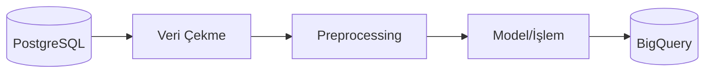

# {{PROJE_ADI}}

> {{KISA_ACIKLAMA}}

<!-- 
╔════════════════════════════════════════════════════════════════╗
║  📝 Data Science - README Template                             ║
╠════════════════════════════════════════════════════════════════╣
║  KULLANIM:                                                     ║
║  1. {{...}} olan yerleri projene göre doldur                   ║
║  2. Gerekmeyen bölümleri sil                                   ║
║  3. Bu yorum bloklarını sil                                    ║
║  4. Mermaid diagramını düzenle                                 ║
╚════════════════════════════════════════════════════════════════╝
-->
---

## 🔄 Pipeline Akışı



<!-- 
MERMAID ÖRNEKLERİ:

Basit akış:
    A[(PostgreSQL)] --> B[Preprocessing] --> C[Model] --> D[(BigQuery)]

Alt süreçli:
    subgraph Processing
        B[Temizleme] --> C[Feature Extraction]
    end

Daha fazla örnek için: [/mnt/skills/mermaid_examples.md](https://gitlab.com/gitlab-org/gitlab-foss/-/issues/3711) 
-->

---

## 📁 Proje Yapısı

```
{{PROJE_ADI}}/
├── .cicd/                      # Dockerfile
├── core/
│   ├── configs/                # config.yml, credentials
│   ├── process/                # Ana iş mantığı
│   └── utils/                  # Yardımcı fonksiyonlar
├── scripts/                    # Build & run scriptleri
├── main.py                     # CLI entry point (Typer)
├── {{DAG_DOSYASI}}_dag.py      # Airflow DAG
├── pyproject.toml
└── uv.lock
```

<!-- 
Projeye göre düzenle.
Farklı klasörler varsa ekle/çıkar.
-->

---

## 🧩 Ana Bileşenler

- **`main.py`** - CLI komutları (Typer)
- **`{{PROCESS_DOSYASI}}.py`** - {{PROCESS_ACIKLAMA}}
- **`config.yml`** - Ortam ayarları (dev/qa/prod)

<!-- 
Önemli dosyaları ve ne yaptıklarını yaz.
3-5 madde yeterli.
-->

---

## ⚙️ Kurulum

```bash
# uv kurulumu 
curl -LsSf https://astral.sh/uv/install.sh | sh

# Bağımlılıkları yükle
uv sync
```

---

## ▶️ Kullanım

```bash
# Development ortamında çalıştır
uv run main.py --env dev {{KOMUT}}

# Production ortamında çalıştır
uv run main.py --env prod {{KOMUT}}
```

<!-- 
TYPER KOMUTLARI:
Projedeki komutları yaz. Örnek:
- exact-match-all-categories
- process-batch
- train-model
-->

---

## 🔧 Ortam Ayarları

`config.yml` dosyasında 3 ortam tanımlıdır:

| Ortam | Açıklama |
|-------|----------|
| `dev` | Geliştirme ve test |
| `qa` | QA testleri |
| `prod` | Production |

---

## 🗄️ Gereksinimler

- Python 3.12+
- [uv](https://github.com/astral-sh/uv) package manager
- {{GEREKSINIM_1}}
- {{GEREKSINIM_2}}

<!-- 
ÖRNEK GEREKSİNİMLER:
- PostgreSQL erişimi
- GCP BigQuery erişimi
- HuggingFace API key
- OpenAI API key
-->

---

## 📝 Notlar

- Credential dosyaları (`.json`) `.gitignore` ile korunur
- Airflow DAG: `{{DAG_DOSYASI}}_dag.py`
- {{EKSTRA_NOT}}

<!-- 
Projeye özel uyarılar, dikkat edilmesi gerekenler vs.
-->
