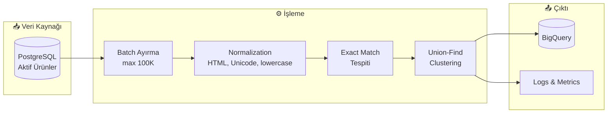
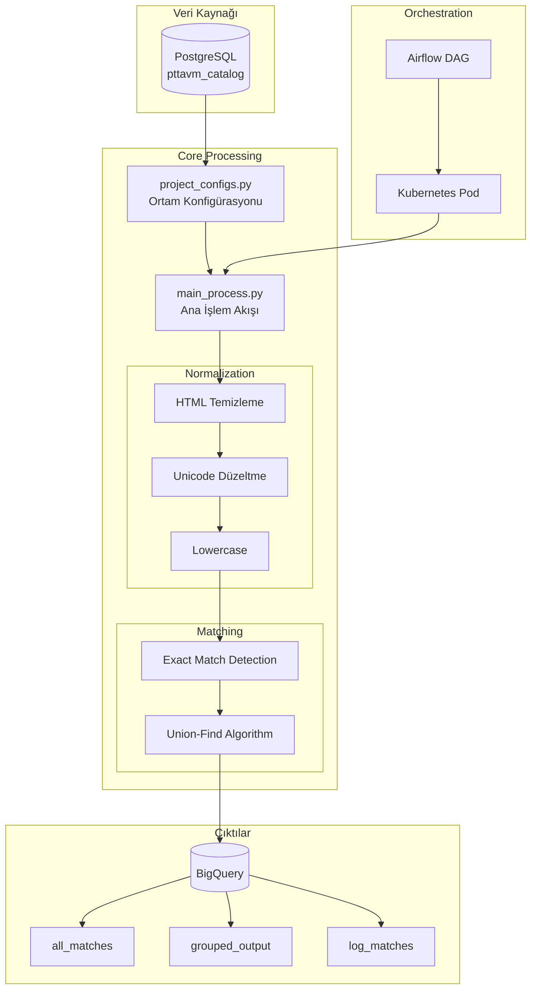
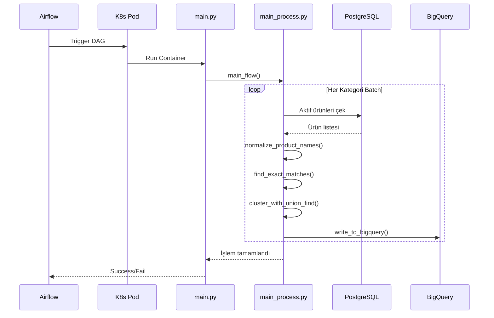

# 🔍 Single Catalog Exact Match

> PttAVM ürün kataloğundaki duplicate ürünleri tespit edip gruplandıran exact match sistemi.


---

## 📋 İçindekiler

- [Genel Bakış](#-genel-bakış)
- [Pipeline Akışı](#-pipeline-akışı)
- [Proje Yapısı](#-proje-yapısı)
- [Kurulum](#-kurulum)
- [Kullanım](#-kullanım)
- [Konfigürasyon](#️-konfigürasyon)
- [Deployment](#-deployment)
- [Monitoring](#-monitoring)

---

## 🎯 Genel Bakış

### Problem
E-ticaret kataloglarında aynı ürünün farklı satıcılar tarafından farklı isimlerle listelenmesi, müşteri deneyimini olumsuz etkiler ve katalog yönetimini zorlaştırır.

### Çözüm
Bu sistem, ürün isimlerini normalize ederek exact match tespiti yapar ve Union-Find algoritmasıyla duplicate ürünleri gruplandırır.

### Temel Özellikler
- ✅ Batch bazlı işleme (100K ürün/batch)
- ✅ Kategori bazlı exact match
- ✅ Union-Find ile akıllı clustering
- ✅ Multi-environment desteği (dev/qa/prod)
- ✅ Airflow entegrasyonu
- ✅ Kubernetes deployment

---

## 🔄 Pipeline Akışı



### Detaylı Sistem Mimarisi



### Sequence Diagram



---

## 📁 Proje Yapısı

```
single_catalog_exact_matching/
│
├── 📂 .cicd/                          # CI/CD & Container
│   ├── .dockerignore
│   └── Dockerfile
│
├── 📂 core/                           # Ana modüller
│   ├── 📂 configs/                    # Konfigürasyon
│   │   ├── config.yml                 # Ortam ayarları (dev/qa/prod)
│   │   ├── project_configs.py         # Config loader & GCP/PG bağlantıları
│   │   └── ptt-data-prod.json         # GCP service account
│   │
│   ├── 📂 process/                    # İş mantığı
│   │   ├── main_process.py            # Ana işlem akışı
│   │   └── send_to_api.py             # API entegrasyonu
│   │
│   ├── 📂 product_req/                # Araştırma & Notebooks
│   │   ├── data_sharing_bq.ipynb
│   │   └── rule_based_exact_match_refined.ipynb
│   │
│   └── 📂 utils/                      # Yardımcı modüller
│       ├── 📂 db_connectors/          # Veritabanı bağlantıları
│       │   ├── db_interface.py        # Abstract interface
│       │   ├── db_manager.py          # CRUD operasyonları
│       │   ├── gcp_conn.py            # BigQuery bağlantısı
│       │   └── postgres_conn.py       # PostgreSQL bağlantısı
│       └── datetime_utils.py
│
├── 📂 scripts/                        # Build & Run scriptleri
│   ├── prod-build.sh
│   └── prod-run.sh
│
├── main.py                            # CLI entry point (Typer)
├── sc_exactmatch_dag.py               # Airflow DAG tanımı
├── pyproject.toml                     # Proje bağımlılıkları
├── uv.lock                            # Lock file
├── .gitlab-ci.yml                     # GitLab CI pipeline
└── README.md
```

---

## 🚀 Kurulum

### Gereksinimler

- Python 3.12.x
- [uv](https://github.com/astral-sh/uv) package manager
- PostgreSQL erişimi
- GCP BigQuery erişimi

### Adımlar

```bash
# 1. Repository'yi klonla
git clone https://gitlab.pttavm.com/datascience-team/sc_exact_match.git
cd sc_exact_match

# 2. uv kurulumu (eğer yoksa)
curl -LsSf https://astral.sh/uv/install.sh | sh

# 3. Ortam senkronizasyonu
uv sync

# 4. Test çalıştırması
uv run main.py --env dev exact-match-category-list
```

> 💡 **uv Nedir?**  
> Rust'ta yazılmış, son derece hızlı bir Python paketi ve proje yöneticisi.  
> `uv` = `pip` + `pip-tools` + `virtualenv` + `poetry`

---

## 💻 Kullanım

### CLI Komutları

Proje, Typer ile iki ana komut sunar:

```bash
# Tüm kategoriler için exact match
uv run main.py --env <ortam> exact-match-all-categories

# Belirli kategori listesi için exact match
uv run main.py --env <ortam> exact-match-category-list
```

### Örnekler

```bash
# Development ortamında test
uv run main.py --env dev exact-match-category-list

# QA ortamında çalıştır
uv run main.py --env qa exact-match-all-categories

# Production ortamında çalıştır
uv run main.py --env prod exact-match-all-categories
```

---

## ⚙️ Konfigürasyon

### Ortamlar

`config.yml` dosyasında üç ortam tanımlıdır:

| Ortam | GCP Dataset | Kullanım |
|-------|-------------|----------|
| `dev` | `ptt-data-test.ds_single_catalog` | Geliştirme & test |
| `qa` | `ptt-data-qa.ds_single_catalog` | QA testleri |
| `prod` | `ptt-data-prod.ds_single_catalog` | Production |

### config.yml Yapısı

```yaml
dev:
  gcp:
    project_id: "ptt-data-test"
    dataset: "ds_single_catalog"
  postgres:
    host: "dev-db-host"
    database: "pttavm"
    
qa:
  # ...
  
prod:
  # ...
```

---

## 🚢 Deployment

### Docker Build

```bash
# Production build
./scripts/prod-build.sh

# veya manuel
docker build -f .cicd/Dockerfile -t sc-exact-match:latest .
```

### Kubernetes

Airflow DAG dosyası (`sc_exactmatch_dag.py`) KubernetesPodOperator kullanarak container'ı çalıştırır.

```python
# sc_exactmatch_dag.py örnek yapısı
KubernetesPodOperator(
    task_id="sc_exact_match_task",
    image="sc-exact-match:latest",
    cmds=["uv", "run", "main.py"],
    arguments=["--env", "prod", "exact-match-all-categories"],
    ...
)
```

### GitLab CI/CD

`.gitlab-ci.yml` ile otomatik build ve deploy:

```yaml
stages:
  - build
  - deploy
```

---

## 📊 Monitoring

### BigQuery Tabloları

| Tablo | Açıklama |
|-------|----------|
| `all_matches` | Tüm tespit edilen eşleşmeler |
| `grouped_output` | Union-Find cluster sonuçları |
| `log_matches` | İşlem logları ve metrikler |

### Airflow UI

- DAG durumu ve çalışma geçmişi
- Task logları
- Retry ve hata yönetimi

### Log Formatı

Loglar `main_process.py` başındaki `log_config` ile yapılandırılır.

---

## 📚 Ana Fonksiyonlar

| Fonksiyon | Modül | Görev |
|-----------|-------|-------|
| `get_category_batches()` | `main_process.py` | Kategori listesini batch'lere ayırır |
| `normalize_product_names()` | `main_process.py` | HTML temizleme, Unicode, lowercase |
| `find_exact_matches()` | `main_process.py` | Aynı isme sahip ürünleri eşleştirir |
| `cluster_with_union_find()` | `main_process.py` | Union-Find ile clustering |
| `write_to_bigquery()` | `gcp_conn.py` | Sonuçları BQ'ya yazar |
| `main_flow()` | `main_process.py` | Tüm süreci orchestrate eder |

---

## 📝 Notlar

- Fonksiyonlar modülerdir ve bağımsız test edilebilir
- Yeni özellik eklenirken önce `utils/` altına fonksiyon eklenir
- Credential dosyaları (`.json`) `.gitignore` ile korunur
- Büyük embedding/index dosyaları repo dışında saklanmalıdır

---

## 👥 Katkıda Bulunanlar

| İsim | Rol |
|------|-----|
| | |
| | |
| | |

---

## 🔗 İlgili Kaynaklar

- [Confluence Dokümantasyonu](#)
- [Airflow Dashboard](#)
- [BigQuery Console](#)
